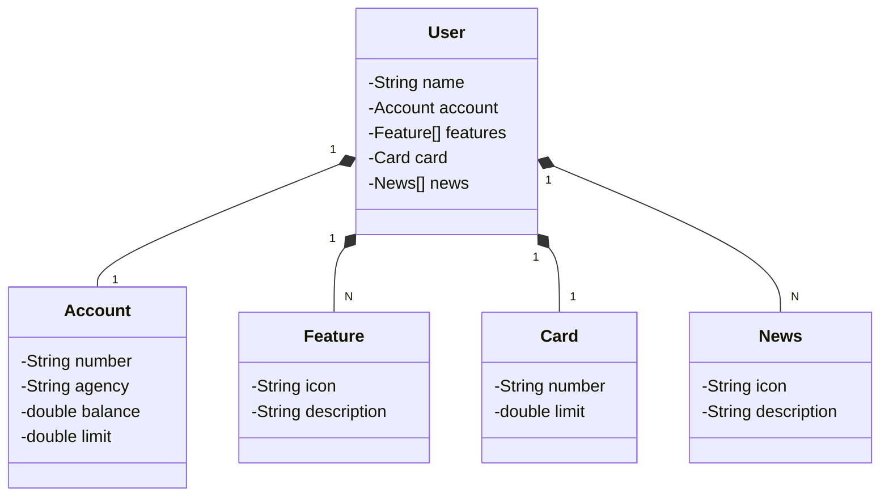

# Santander Dev Week 2023

Esta é uma API RESTful Java criada para a **Santander Dev Week 2023**.

## Principais Tecnologias

- **Java 17**: Utilizamos a versão LTS mais recente do Java para aproveitar as inovações que essa linguagem robusta oferece.
- **Spring Boot 3**: A mais nova versão do Spring Boot, focada em maximizar a produtividade por meio de autoconfiguração poderosa.
- **Spring Data JPA**: Facilita a integração com bancos de dados SQL, simplificando o acesso e manipulação de dados.
- **OpenAPI (Swagger)**: Documentação da API com OpenAPI (Swagger), garantindo clareza e facilidade de uso.
- **Railway**: Utilizado para deploy e monitoramento na nuvem, oferecendo suporte a bancos de dados como serviço e pipelines CI/CD.

## Diagrama de classes

