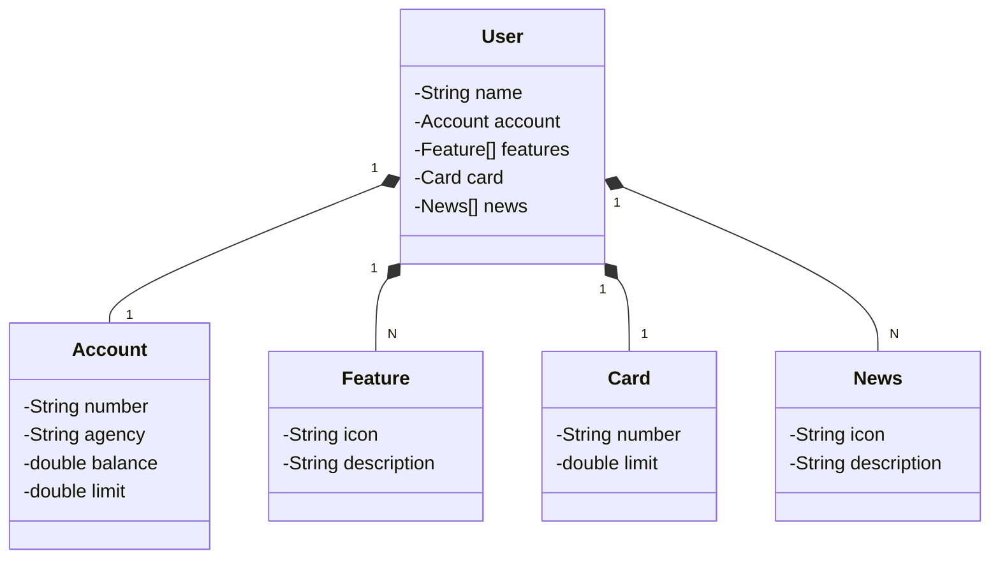

# Santander Dev Week 2023
Java RESTFul API criado para a DIO e futuramente uso proprio

## Diagrama de classes

```mermaid
classDiagram
    class User {
        -String name
        -Account account
        -Feature[] features
        -Card card
        -News[] news
    }
    class Account {
        -String number
        -String agency
        -double balance
        -double limit
    }
    class Feature {
        -String icon
        -String description
    }
    class Card {
        -String number
        -double limit
    }
    class News {
        -String icon
        -String description
    }
    User "1" *-- "1" Account
    User "1" *-- "N" Feature
    User "1" *-- "1" Card
    User "1" *-- "N" News
```
